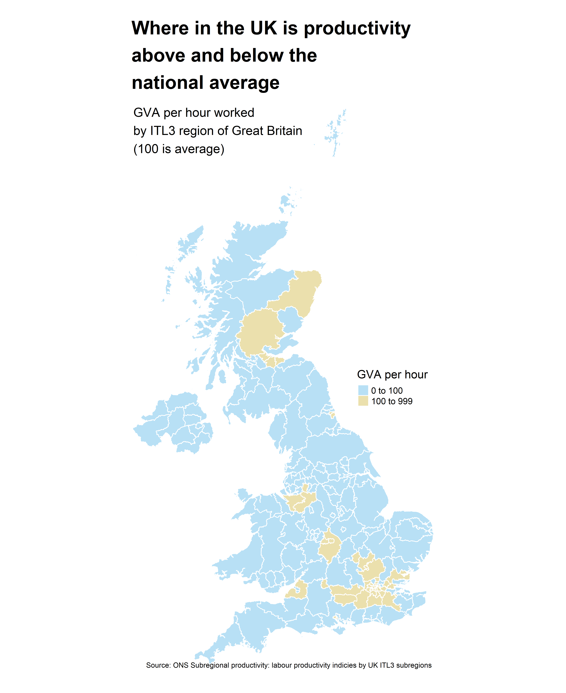
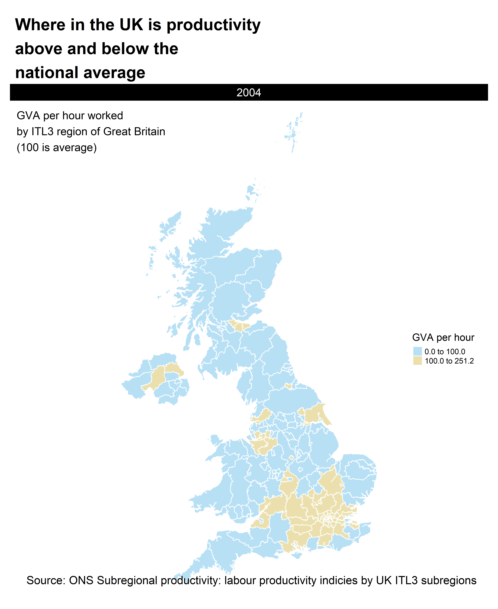

Reproducible plotting of UK productivity Data from ONS
================

## how to run

download
International_Territorial_Level_3\_January_2021_UK_BGC_V3_2022\_-3166856060823825625.geojson
from the url
https://geoportal.statistics.gov.uk/datasets/ons::international-territorial-level-3-january-2021-uk-bfc-v3-1/explore?location=55.215450%2C-3.316605%2C6.91
and save in working directory

open script its_prod.R

make sure you have all the packages, the latest version of R studio
checks on loading scripts. All these packages are from the CRAN so R
studio should be able to install them.

Select the whole script and run.

First output is productivity in 2019 above and below the average (100)

Second is a gif of the same plot but for the full dataset (2004 to 2021)

